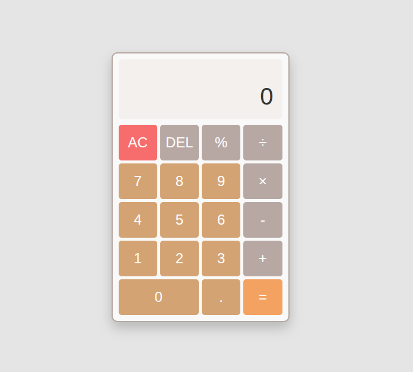

## 🔧 Tech Stack


# Calculator Project

A robust, web-based calculator built with vanilla JavaScript. This project focuses on **state management**, **edge case handling**, and replicating the feel of a standard calculator with keyboard support and responsive design.

Part of **The Odin Project** curriculum, this implementation goes beyond the basics by introducing comprehensive error handling (e.g., division by zero) and scientific notation for large numbers.

## 🚀 Live Demo

👉 **[https://mariaingerslev.github.io/calculator/](https://mariaingerslev.github.io/calculator/)**

## 📸 Screenshot



## 🎮 Features

- **Core Math Operations:** Addition, subtraction, multiplication, division.
- **Keyboard Support:** Full numpad and keyboard integration (Enter for `=`, Escape for `AC`, etc.).
- **Scientific Notation:** Automatically formats results exceeding 10 digits to exponential format (e.g., `1.23e+12`).
- **Decimal Precision:** Smart rounding to avoid standard floating-point errors (e.g., `0.1 + 0.2`).
- **Percentage Logic:** Calculates percentages dynamically based on context (single operand vs. operation).
- **Responsive Design:** Flexbox-based layout that scales smoothly.

## 🔧 What I Improved & Solved

### 🧠 1. Robust JavaScript Architecture
Instead of "spaghetti code," I separated the application into distinct logical layers:
- **State Management:** Global variables track `firstOperand`, `secondOperand`, and `currentOperator` independently of the UI.
- **Handler Functions:** Specialized functions (`handleNumber`, `handleOperator`, `handleDecimal`) manage the flow control.
- **Guard Clauses:** The code actively prevents invalid states, such as:
  - Multiple decimal points in one number.
  - Inputting more digits than the display can handle (`MAX_INPUT_LENGTH`).
  - Division by zero (returns specific error messages).

### 🎨 2. Advanced CSS Techniques
- **CSS Variables:** Used for consistent theming across the calculator buttons and background.
- **Layout Logic:** The zero button uses `calc(50% - (var(--btn-gap) / 2))` to align perfectly with the grid above it, ensuring pixel-perfect layout without using CSS Grid.
- **Visual Feedback:** Filters and transforms allow for a tactile feel on hover and click.

## 📂 Project Structure

```bash
/calculator-project
│── index.html      # Structure
│── style.css       # Styling & Variables
│── script.js       # Logic, State & Event Listeners
│── README.md       # Documentation
└── images/         # Project screenshots
    └── calculator.png
```

## 📚 What I Learned

### 🌿 From the Code Logic
- **Floating Point Math:** Learned how to handle JavaScript's quirky math (e.g., implementing `.toFixed()` and `parseFloat()` logic in my `formatResult` function).
- **Separation of Concerns:** Keeping the calculation logic (`operate` function) separate from the DOM updates (`updateDisplay`).
- **Event Delegation vs. Loop:** I utilized `forEach` on buttons but also implemented a global `window` listener for keyboard events to capture input regardless of focus.

### 🌳 From the Process (Git & Refactoring)
- **Conventional Commits:** As seen in my commit history, I strictly followed conventions like `feat:`, `fix:`, and `refactor:` to keep a clean history.
- **Refactoring:** I realized mid-project that my `operate` function needed to handle chained operations (e.g., `5 + 5 + 5`), requiring a refactor of the state flow.
- **Edge Case Testing:** I spent significant time ensuring that pressing `=` multiple times or switching operators mid-calculation didn't crash the app.

## 🧩 Future Improvements
- Add visual feedback (active state) to UI buttons when triggering actions via keyboard.
- Implement a "history" tape to show previous calculations.

## ▶️ How to Run Locally

1. Clone the repository:
```bash
git clone [https://github.com/MariaIngerslev/calculator.git](https://github.com/MariaIngerslev/calculator.git)
```

2. Navigate to the folder:
```bash
cd calculator
```

3. Open index.html in your browser.